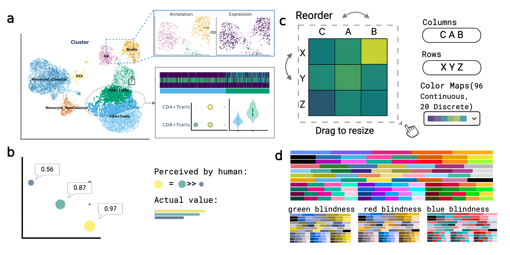

# GUANACO: Intuitive Visual Exploration of Multi-Omics Data
<table border="0" cellspacing="0" cellpadding="0">
  <tr>
    <td width="120" align="center" valign="top">
      
    </td>
    <td style="padding-left: 20px;">
      <strong>GUANACO</strong> (Graphical Unified Analysis and Navigation of Cellular Omics) is a Python-based platform that empowers biologists to explore multi-omics single-cell data directly in the browser with clicks<br><br>
      <strong>GUANACO</strong> leverages interactive visualizations to make data exploration and figure customization effortless:
    </td>
  </tr>
</table>

- **Free cell selection** – Select cells with a click or lasso, define custom subpopulations as easily as drawing on paper.
- **Perception-aware tooltips** – Prevent misinterpretation by revealing actual values behind the visualization
- **100+ color maps** – Choose from a wide range of continuous and discrete palettes, including options optimized for color vision deficiencies.
- **Interactive layout** – Resize plots, reorder axes, and zoom in on details all directly in the browser



Example Interface 👉 [Launch the interactive demo](https://your-demo-link.com)


## Installation

### 1. Clone the repository
```bash
git clone https://github.com/Systems-Immunometabolism-Lab/GUANACO_updated
cd GUANACO_updated
```

### 2. Install from local directory
```bash
pip install .
```
Or for development (editable install):
```bash
pip install -e .
```
## Usage
```bash
guanaco -c config.json -d data_folder
```

### Command-line Options

- `-c, --config`: Name of configuration JSON file (relative to --data-dir) (default: guanaco.json)
- `-d, --data-dir`: Directory containing AnnData files referenced in config (default: current directory)
- `-p, --port`: Port to run the Dash server on (default: 4399)
- `--host`: Host to run the Dash server on (default: 0.0.0.0)
- `--debug`: Run server in debug mode
- `--max-cells`: Maximum number of cells to load per dataset (default: 8000)
- `--backed-mode`: Enable backed mode for memory-efficient loading of large datasets

## Configuration

Create a configuration JSON file specifying your datasets. See `example_config.json` for a complete example configuration. Simpliest case for visualizing scRNA data(.h5ad) is:
```
{
  "Demo": {"sc_data": "PBMC_int.h5ad"}
}
```
## Plot types

**Interactive embeddings**: Linked UMAP/t-SNE visualizations with cell metadata/gene expression overlay. Select cells from embeddings to 

- **Gene expression heatmaps**: Clustered heatmaps with customizable parameters
- **Violin plots**: Distribution plots for gene expression across cell types
- **Dot plots**: Gene expression intensity and percentage visualization
- **Stacked bar charts**: Cell type composition analysis
- **Pseudotime analysis**: Trajectory analysis visualization
- **Genome Browser** for track data

